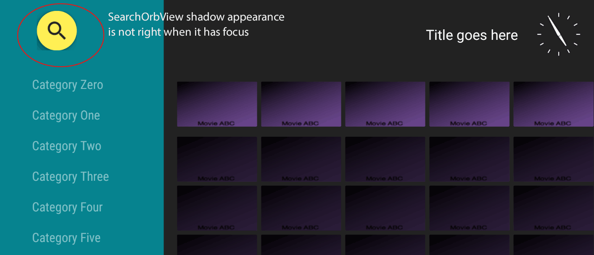

## What is this?
I created this demo project to demonstrate a bug that I encountered when trying to make a custom titlebar for my project.

## The Leanback SearchOrbView is not looking right when it has focus
It has a square shadow



## What I did:

* Created a new Tv project from Android Studio
* Copied the the methods described in the leanback showcase demo to create a Custom Titlebar
```sh
https://github.com/googlesamples/leanback-showcase
```

## In the new Tv project:
1. Created `themes.xml` with the exact same values as in the leanback showcase
2. Copied the views: `custom_titleview.xml` and `titleview.xml`
3. Copied `CustomTitleView.java`
4. Changed the `AndroidManifest.xml` to reference the theme for MainActivity

* In custom_titleview.xml I changed the SearchOrbView id from `android:id="@+id/search_orb"` to `android:id="@+id/search_orb2"`
* In CustomTitleView.java I changed: `mSearchOrbView = root.findViewById(R.id.search_orb2);`
